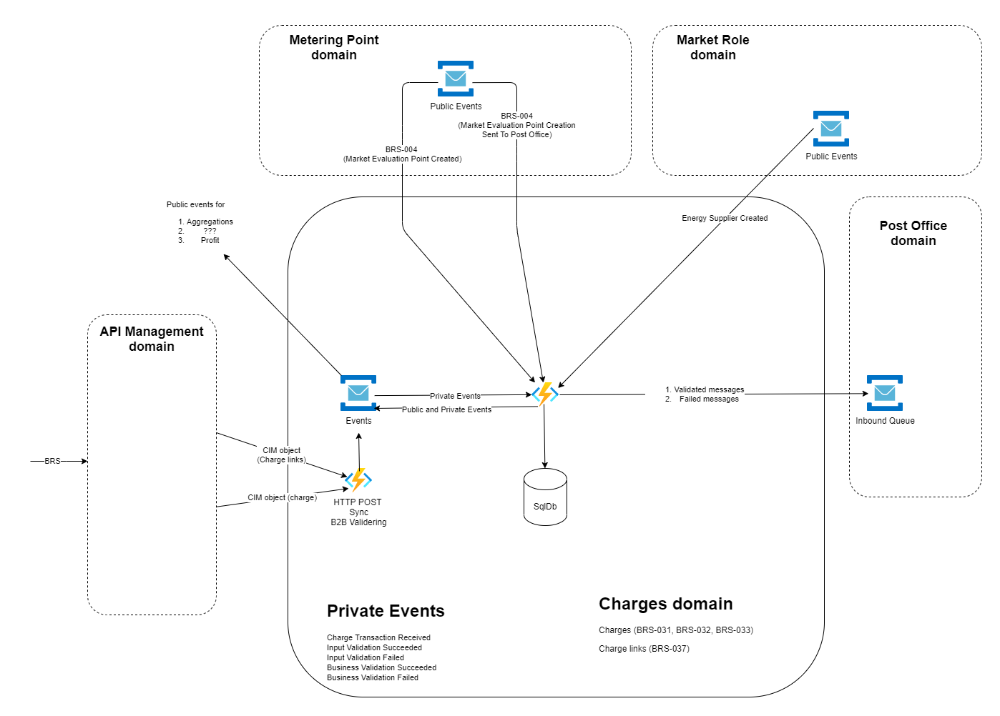

# Charges

## Intro

Welcome to the charges domain of the [Green Energy Hub project](https://github.com/Energinet-DataHub/green-energy-hub)

The charges domain is responsible for keeping track of price lists of grid companies and prices set by laws on the national level (fees and taxes).

In addition, the charges domain also keep track of which of these prices a specific market evaluation point is assigned to at any given moment in time.

More introduction to come.

## Architecture

The following architectural sketch is an incomplete work in progress and for now partially in danish. This will be changes as the domain settles.

## Repository origin

This repository was created using the Green Energy Hub template.

Please read the [template readme](./docs/template-readme/README.md) for details and introduction to the template.