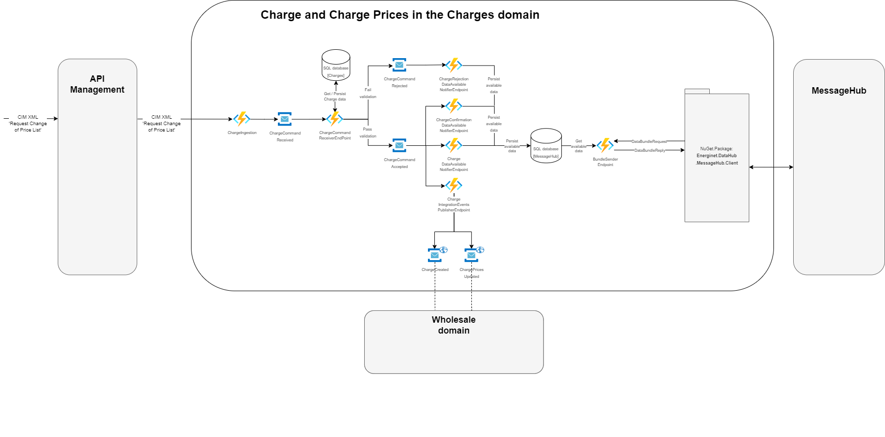
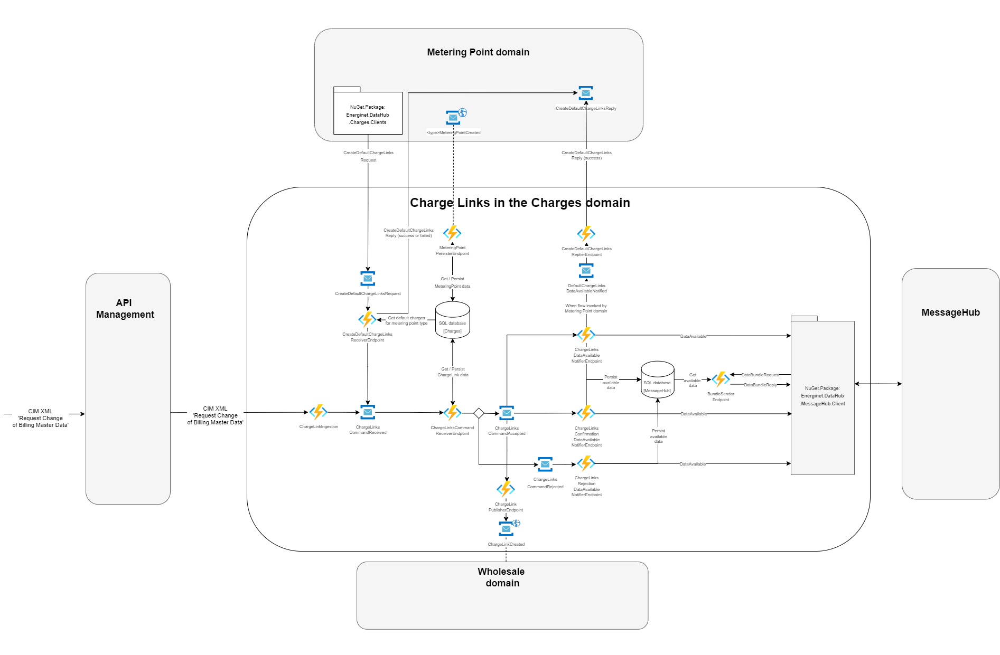

# Charges

## Intro

Welcome to the charges domain of the [Green Energy Hub project](https://github.com/Energinet-DataHub/green-energy-hub)

The charges domain is responsible for keeping track of price lists of Grid Access Providers and Transmission System Operators (TSO). A charge may be a fee, a subscription or a tariff, where the latter has the option of being a tax.

In addition, the charges domain also keeps track of which of these prices are assigned to a specific metering point at any given moment in time.

These are the business processes maintained by this domain.

| Business processes  |
| ------------- |
| [Change of Subscription price list](docs/business-processes/change-of-subscription.md) |
| [Change of Fee price list](docs/business-processes/change-of-fee.md) |
| [Change of Tariff price list](docs/business-processes/change-of-tariff.md) |
| [Request for Prices](docs/business-processes/request-for-prices.md) |
| [Settlement master data for metering point - fee, subscription and tariff links](docs/business-processes/settlement-master-data.md) |

For more information on the system flows supporting the above-mentioned business processes, please see the [process-flows](docs/process-flows/README.md) folder.

## Getting Started

Learn how to get started with Green Energy Hub [here](https://github.com/Energinet-DataHub/green-energy-hub/blob/main/docs/getting-started.md).

Learn how to get a development environment up and running for development, debugging, testing or evaluation purposes [here](docs/local-development/README.md).

## Architecture

The architecture diagrams below illustrate both current state of the Charges domain as well as future work, last-mentioned being illustrated by grey arrows and components with lowered opacity.

The diagrams depict the architecture of `Charge and Charge Prices` and `Charge Links`, respectively.

Please note, all the azure functions displayed in the architecture diagrams are hosted in the same function host.
Also, some components have singular names while others have plural names. This is intended. The components using plural may need to process a bundle of e.g. charge links to determine whether an operation, e.g. validation, was successful.

### Charge and charge prices architecture

### Charge links architecture

### Supporting architecture

Below depicts architectural components which supports the Charges domain in fulfilling its business purpose.
One such example is consuming market participant integration events published by the Market Participant domain. Market participant data is required to authenticate and authorize the sender of incoming requests.

## Context Streams

This sections documents the data flows to and from the Charges domain.

## Public contracts

If you are interested in the public contracts of the Charges domain, please visit this [page](docs/contracts.md).

## Domain Road Map

Planned work for the current program increment (PI):

1. When a charge owner submits a charge price series, using the new business reason code `D08`, the Charges domain will be able to receive, validate, persist and forward it to relevant market participants. When this is implemented, it will no longer be possible to include price series with charge information request submitted with business reason code `D18`.

2. Subscribe to and use the integration events published by the [Market Participant](https://github.com/Energinet-DataHub/geh-market-participant) domain, thereby replacing the existing manual data synchronization process.

## Where can I get more help?

Read about community for Green Energy Hub [here](https://github.com/Energinet-DataHub/green-energy-hub/blob/main/COMMUNITY.md) and learn about how to get involved and get help.

Please note that we have provided a [Dictionary](https://github.com/Energinet-DataHub/green-energy-hub/tree/main/docs/dictionary-and-concepts) to help understand many of the terms used throughout the repository.
