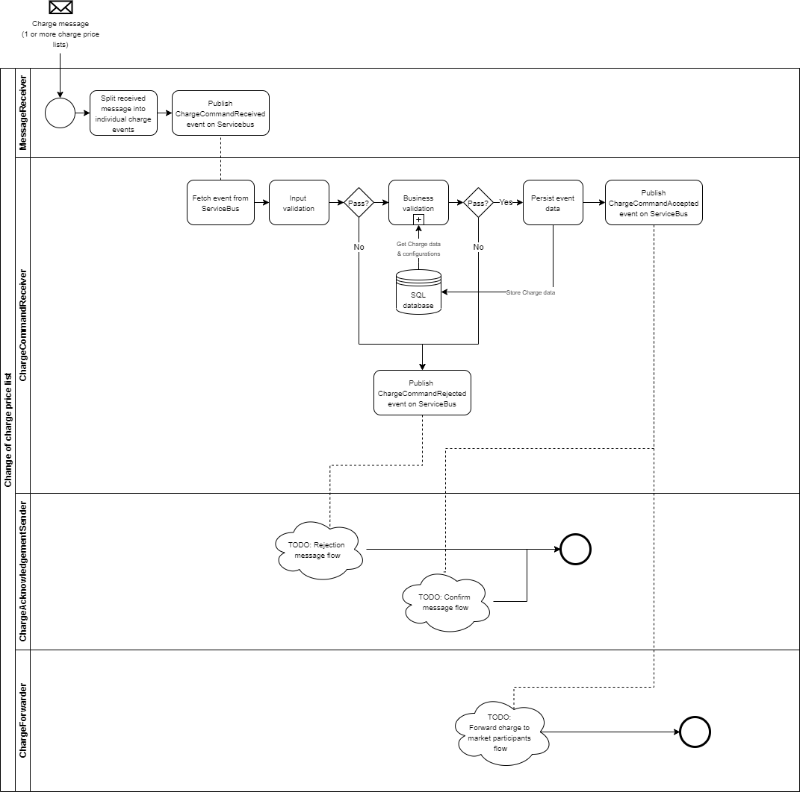

# Change Of Subscription Price List

A subscription is a fixed price for services regarding grid connections and associated services.
The business process _change of subscription price list_ enables a system operator or grid access provider to
manage subscriptions.

Association of subscriptions to metering points are performed using business process _Settlement master data for a metering point –
subscription, fee and tariff links_.

## Process flow

The following process flow depicts the different paths a change of charge price list can take through the domain.
It also shows the micro services involved along with the activities they perform.

## Sequence diagram

The following sequence diagram shows the exchange of messages in this process.

<!-- In order to update this image:
  1. Go to mermaid live editor
  2. Paste the content of the *.mermaid file for the business process (located next to this file)
  3. Add ALT text for link required by MD lint check
  4. Update the sequence diagram in the online editor
  5. Update change-of-subscription.mermaid
  6. Update the link below using the "Copy Markdown" button in the online editor
 -->
[](https://mermaid-js.github.io/mermaid-live-editor/#/edit/eyJjb2RlIjoic2VxdWVuY2VEaWFncmFtXG4gICAgcGFydGljaXBhbnQgTyBhcyBTeXN0ZW0gT3BlcmF0b3IvR3JpZCBBY2Nlc3MgUHJvdmlkZXJcbiAgICBwYXJ0aWNpcGFudCBHRUggYXMgR3JlZW4gRW5lcmd5IEh1YlxuICAgIHBhcnRpY2lwYW50IFMgYXMgRW5lcmd5IFN1cHBsaWVyXG5cbiAgICBhY3RpdmF0ZSBPXG4gICAgYWN0aXZhdGUgR0VIXG4gICAgTy0-PkdFSDogVXBkYXRlIHByaWNlIGxpc3RcbiAgICBHRUgtPj5POiBBcHByb3ZlIHVwZGF0ZSBvZiBwcmljZSBsaXN0XG4gICAgR0VILT4-TzogUmVqZWN0IHVwZGF0ZSBvZiBwcmljZSBsaXN0XG4gICAgZGVhY3RpdmF0ZSBPXG5cbiAgICBhY3RpdmF0ZSBTXG4gICAgR0VILT4-UzogSW5mb3JtYXRpb24gYWJvdXQgdGhlIHVwZGF0ZSBvZiBwcmljZSBsaXN0XG4gICAgTm90ZSBvdmVyIEdFSCwgUzogSWYgc3Vic2NyaXB0aW9uIGlzIGJlaW5nIHN0b3BwZWRcbiAgICBHRUgtPj5TOiBJbmZvcm1hdGlvbiBhYm91dCBjb25uZWN0aW9ucyBvbiB0aGUgbWV0ZXJpbmcgcG9pbnRcbiAgICBkZWFjdGl2YXRlIEdFSFxuICAgIGRlYWN0aXZhdGUgU1xuIiwibWVybWFpZCI6e30sInVwZGF0ZUVkaXRvciI6ZmFsc2V9)
