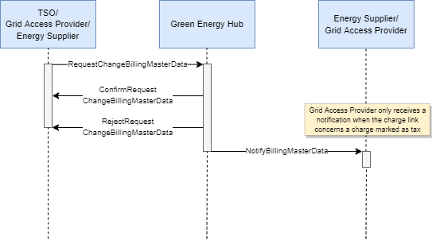

# Settlement master data for metering point - fee, subscription and tariff links

This process handles subscription, fee, and tariff links for a metering point. Jointly referred to as charge links.

To create a correct wholesale settlement basis for the electricity market, the charges registered in Green Energy Hub must be linked to metering points, and these charge links must be forwarded to the relevant market participants.

Grid access providers and the TSO can submit links for their own subscriptions, fees and
tariffs per metering point to Green Energy Hub. The current energy supplier on a metering point is responsible for maintaining the TSO's charge links in accordance with the conditions for collection and thus has the ability to create, update and stop TSO charge links, both for tax and non-tax tariffs within a given time period.

## Sequence diagram

The following sequence diagram shows the exchange of messages in this process.

Green Energy Hub forwards all accepted charge links to the relevant energy suppliers* as well as the grid access provider, should the charge link concern a tariff marked as tax.

<u>*Relevant energy suppliers:</u>

* Subscription/Tariff link: Notification is sent to the energy supplier registered on the metering point on effective date and any future energy suppliers registered on the metering point.

* Fee link: Notification is only sent to the energy supplier registered on the metering point on the effective date.

For further details on how charge links are processed within the system, please see the [charge link flow](../process-flows/README.md/#charge-link-flow).

## Charge links created upon metering point creation (Separate process)

When a grid access provider uses this [process](https://github.com/Energinet-DataHub/geh-metering-point/blob/main/docs/business-processes/create-metering-point.md) to create a new metering point, Green Energy Hub will, for certain types of metering points, on behalf of TSO, create one or more charge links. These are referred to as default charge links. Such links consist of relevant taxes (tariffs marked as tax) and TSO tariffs.
Should any of the default charge links concern a tariff marked as tax, the grid access provider receives a notification per link.

It is always the current energy supplier's responsibility to maintain the TSO links on a metering point, in accordance with the conditions for collection for the specific metering point
