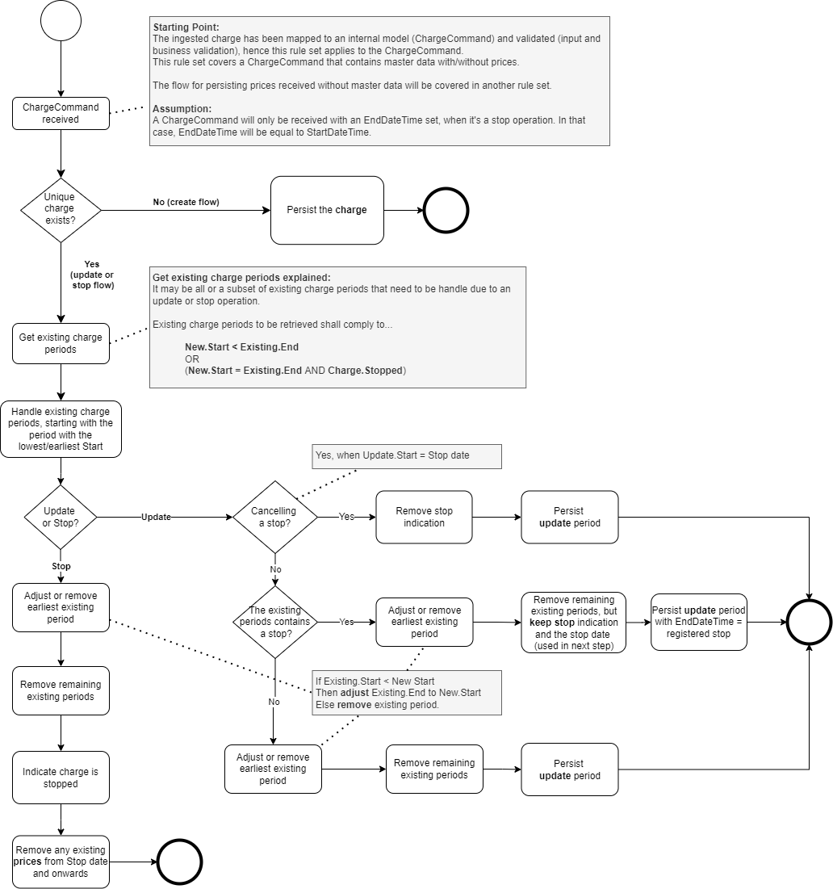
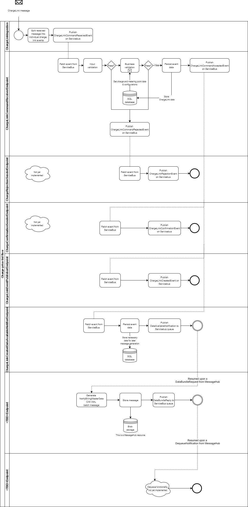

# Process flows - Charges domain

All process flows within the Charges domain will be gathered here.

- [Process Flow For Charge Information And Charge Prices](#Process-Flow-For-Charge-Information-And-Charge-Prices)
    - [Persist Charge Information](#Persist-Charge-Information)
    - [Persist Charge Prices](#Persist-Charge-Prices)
        - [Irregular Price Series](#Irregular-Price-Series)
- [Charge Link Flow](#Charge-Link-Flow)

## Process Flow For Charge Information And Charge Prices

Below process flow covers both the handling of `Charge Information` and `Charge Prices` request as they rather identical. Do note that whenever an event is mentioned, when looking in the source code the events will be prefixed with either `ChargeInformation` or `ChargePrices`.

### Persist Charge Information

The below process flow depicts the rule set applied in the `ChargeCommandReceiverEndpoint` for persisting incoming charges in the SQL database.  
It documents the different persistence paths the system takes given circumstances like charge already exists (same Charge ID, type and owner), whether it is an update or stop operation, and whether a stop already exists on the charge's timeline and if this stop is being cancelled or not.

The rule set was built upon the scenarios listed [here](images/PersistingCharges_Update_And_Stop_MasterData_Examples.png) and it is assumed that the incoming charge has been converted to an internal model, i.e. the Charge Command and has passed both input and business validation.

Note, stopping a charge results in a removal of any registered prices from the stop date and forwards.

 

### Persist Charge Prices

The rule set for persisting charge prices.

 

#### <b>Irregular Price Series</b>

A charge owner may want to submit a charge price request (D08) containing a price series for monthly (resolution) charge, where the price series' start and end date time values do <b>not</b> equal the first of a month. Such a price series is to be known as an <b>irregular price series</b> and it may be relevant when the charge owner wants to:

- change the monthly charge price during the month
- submit a price up to the charge's stop date, which may be during a month

Currently an irregular price series is only relevant for charges with a monthly resolution (P1M), such as fees and subscriptions.

The rule set for persisting irregular price series is no different than the normal way of persisting charge prices, nevertheless a list of irregular price series persistence scenarios and their expected outcome can be found [here](images/Persisting_Irregular_PriceSeries_Examples.png).

 

## Charge Link Flow

The following image depicts the charge link process flow.
It also shows the micro services involved along with the activities they perform.

