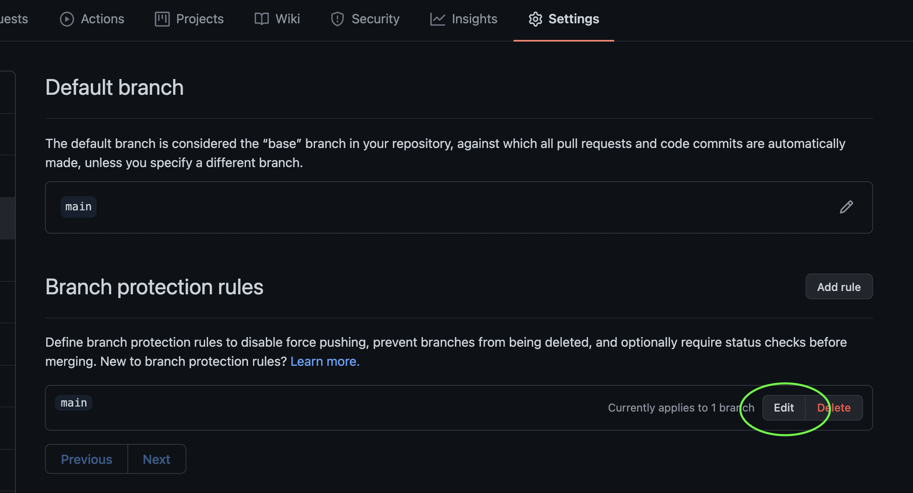
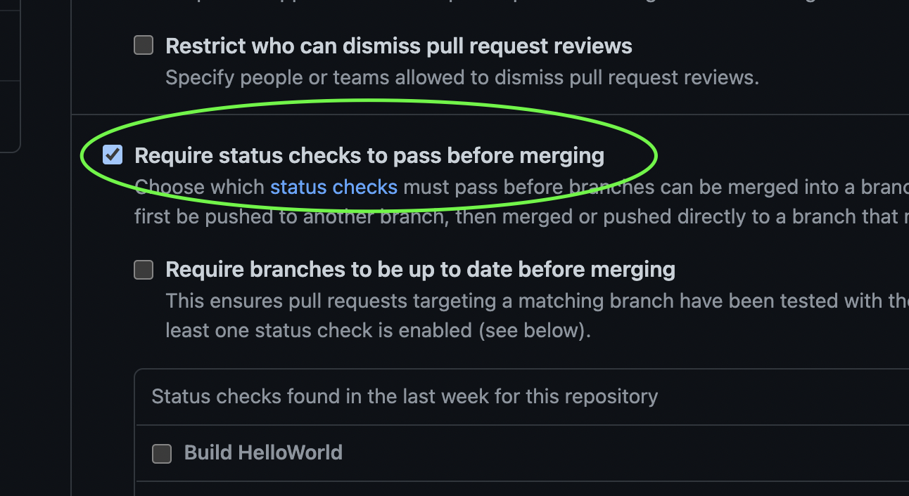
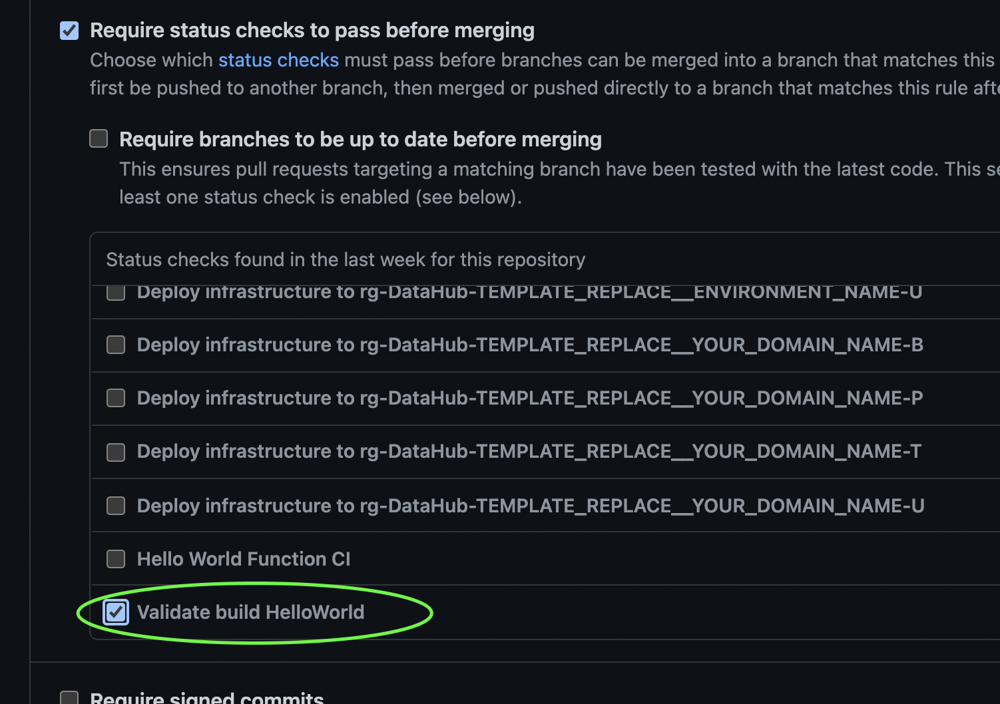

# Template

- [Intro](#intro)
- [Getting started](#getting-started)
- [Whats included?](#whats-included)
    - [Files](#files)
    - [Terraform project including CD](#terraform-project-including-cd)
    - [.NET Azure function project including CD](#.net-azure-function-project-including-cd)
- [Getting started](#getting-started)
    - [How to begin using the Terraform project](#how-to-begin-using-the-terraform-project)
    - [How to begin developing .NET](#how-to-begin-developing-net)
- [I need help](#i-need-help)

## Intro

This domain repository was created using the template located [here](https://github.com/Energinet-DataHub/geh-domain-template-repository).

The reason for using the template to create this domain, is to deliver the basic structure needed to be able to develop and deliver code, without having to spend time on setting up the basic structure needed (CI/CD, IaC etc.), and to ensure consistency across all domain repositories.

## Whats included?

The template comes with a basic set of files, and projects, that will make it easier for you to get started doing what you love the most. **Write code!**

### Files

- [`LICENSE`](../../LICENSE) Required file for open source repositories inside this organisation.
- [`.gitignore`](../../.gitignore) `.gitignore` template file.
- [`.github/ISSUE_TEMPLATE`](../../.github/ISSUE_TEMPLATE) A set of github templates to ensure consistency in how issues is created across all repositories.
- [`.github/PULL_REQUEST_TEMPLATE.md`](../../.github/PULL_REQUEST_TEMPLATE.md) A template for pull requests in this repository. Created to ensure consistency in how pull requests is looks across all repositories.

### Terraform project including CD

- [`build/infrastructure`](../../build/infrastructure) A Terraform setup that can be extended with all the components needed for this domain. It comes with an application insights component, since the general though was that all domains have a need to log data. Read [Application Insights](https://docs.microsoft.com/en-us/azure/azure-monitor/app/app-insights-overview) for more information.
- [`.github/workflows/infrastructure-cd.yml`](../../.github/workflows/infrastructure-cd.yml) A pipeline used for continuous delivery of the Terraform project to all environments.

### .NET Azure Function project including CD

- [`source/hello-world`](../../source/hello-world) An Azure Function solution/project for .NET.
- [`.github/workflows/hello-world-cd.yml`](../../.github/workflows/hello-world-cd.yml) A pipeline for continuous deployment of the `HelloWorld` project.
- [`.github/workflows/templates/hello-world-ci.yml`](../../.github/workflows/hello-world-ci.yml) A pipeline for continuous integration. This is to be used in branch protection rules.

### .NET Analyzers

- [`Directory.Build.props`](../../Directory.Build.props) For more information on `MSBuild` and how it works, please refer to the [official documentation](https://docs.microsoft.com/en-us/visualstudio/msbuild/customize-your-build?view=vs-2019#directorybuildprops-and-directorybuildtargets).
- [`stylecop.json`](../../stylecop.json) `StyleCop Analyzers` configuration file.
- [`.editorconfig`](../../.editorconfig) `.editorconfig` template file used in this organization.

## Getting started

As mentioned above, cooked into this template is some basic projects, that helps you start delivering code.
This includes: CI/CD for Azure Functions, Infrastructure as Code using Terraform and an Analyzer setup for .NET development

### How to begin using the Terraform project

To get started using the Terraform project, all you have to do i actually just add your new files to the directory located [here](../../build/infrastructure).

The infrastructure pipeline will automatically pick up any new changes to this directory on the main branch, and deploy it to the different environments.

### How to begin developing .NET

To create new .NET Function projects inside this repository, you only have to follow a few simple steps.
The following example, assumes that you have a new solution that is named `MyNewSolution`, and inside that an Azure HTTP Trigger named `MyNewTrigger`.

1. Creating the project
    1. Create a new folder named `MyNewSolution` inside the [source](../../source) folder.
    2. Inside the newly created folder from step 1, create your .NET solution.
    3. Create an Azure HTTP Trigger project inside the `MyNewSolution` solution named `MyNewTrigger`.
2. Set up the continuous integration
    1. Duplicate the azure-function-ci-template.yml file located here [`.github/templates/azure-function-ci-template.yml`](../../.github/templates/azure-function-ci-template.yml).
    2. Rename it to fit your project name, in this case `my-new-trigger-ci.yml`.
    3. Inside the `my-new-trigger-ci.yml` file replace all the values that is prefixed with the following `TEMPLATE_REPLACE__`.
3. Set up the continuous delivery
    1. Duplicate the azure-function-ci-template.yml file located here [`.github/templates/azure-function-cd-template.yml`](../../.github/templates/azure-function-cd-template.yml).
    2. Rename it to fit your project name, in this case `my-new-trigger-cd.yml`.
    3. Inside the `my-new-trigger-cd.yml` file replace all the values that is prefixed with the following `TEMPLATE_REPLACE__`.
4. Adding your new project to the branch protection rules
    1. Navigate to the settings->branches and click the edit button next to the `main` branch
    
    2. Scroll down to the `Require status checks to pass before merging`.
    
    3. Locate your new CI build check, and make sure that is is checked.
    (If it does not appear, you may have to trigger it once, e.g. Via the manual dispatch)
    
    4. Scroll down to the bottom of the page, and click the green `Save changes`. Your CI check, will now be a part of the checks all pull requests to main, will have to pass to be mergeable.

## I need help

If you need help, or have any questions in regards to anything related to this template, you can reach out to the authors.

### Authors

- `René T. Nielsen` [`renetdev@gmail.com`](mailto:renetdev@gmail.com)

## Contributing

All contributions to this template, can be created as pull requests in this repository.
Please remember to add yourself to the [Authors Section](#authors).
